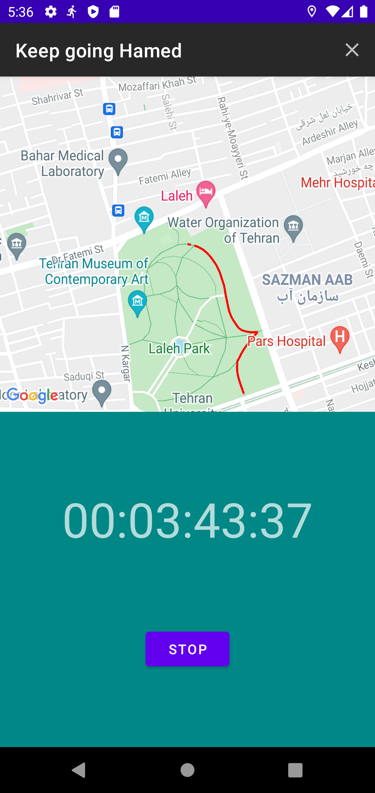
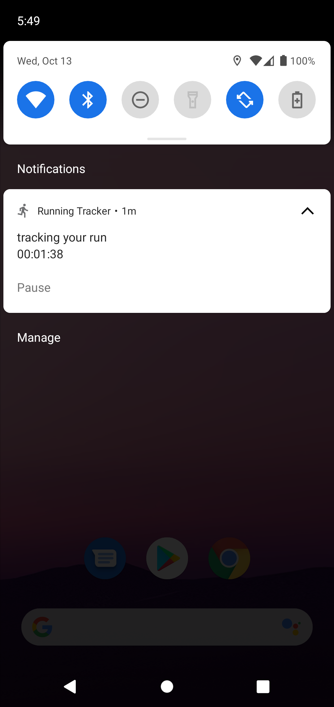
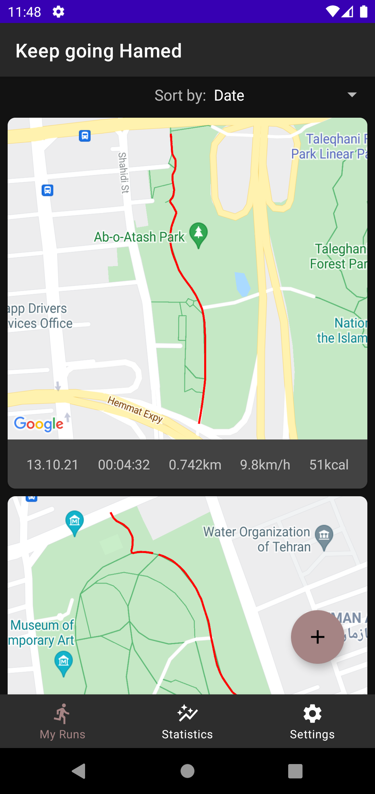
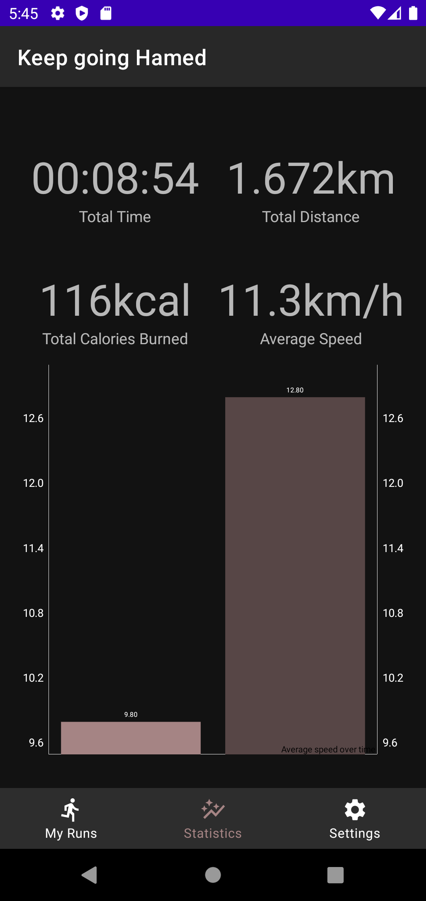

# Description 
 A Running tracker app that make use of google map api to track user location an draw the path and store them in room database.

### Features
- MVVM
- Dependency injection
- Google map service
- Run time permission request
- Single activity

## Preview

## Components used in the application
- play service map
- play service location
- AndroidViewModel
- Dagger Hilt
- Room
- Coroutines
- LiveData
- Navigation component
- Kpermissions
- MPAndroidChart
- Glide

## How to use
To build this source code in your Android studio you need Google Map Api key. 
make a file named local.properties in source code root folder and add your api key to the file.

    MAPS_API_KEY=place your key here

# Licence

    Copyright 2021 Hamed Vakhide
    
    Licensed under the Apache License, Version 2.0 (the "License");
    you may not use this file except in compliance with the License.
    You may obtain a copy of the License at
    
        http://www.apache.org/licenses/LICENSE-2.0
    
    Unless required by applicable law or agreed to in writing, software
    distributed under the License is distributed on an "AS IS" BASIS,
    WITHOUT WARRANTIES OR CONDITIONS OF ANY KIND, either express or implied.
    See the License for the specific language governing permissions and
    limitations under the License.